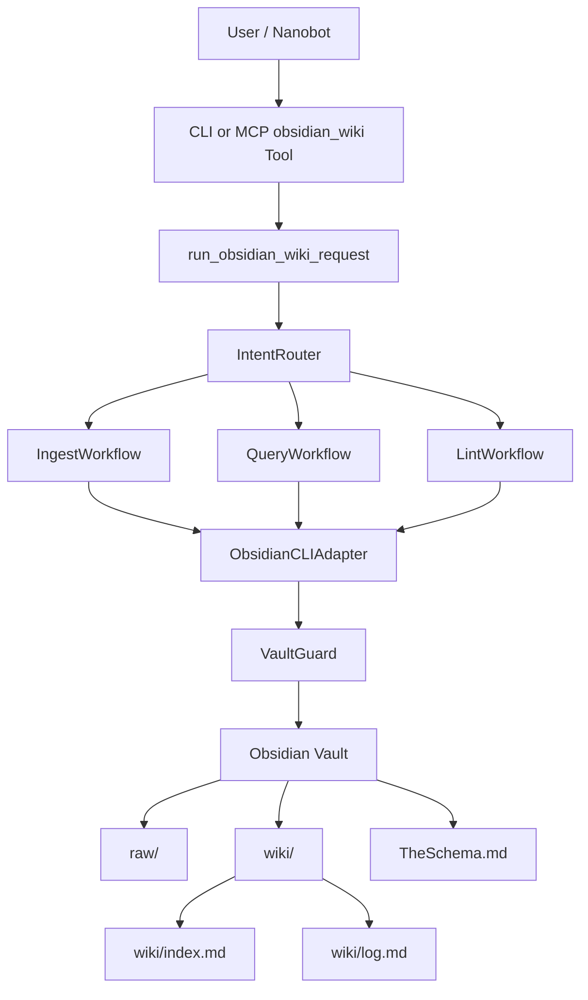
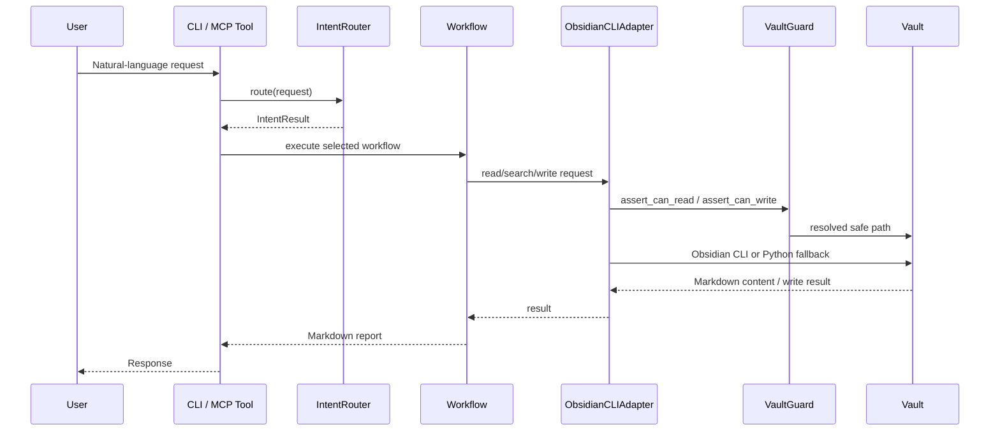
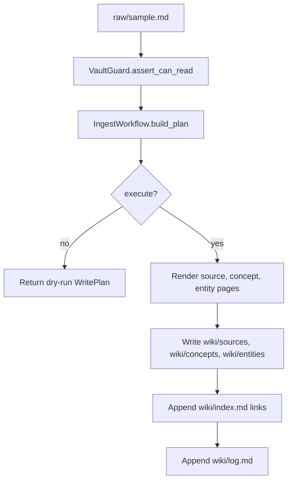
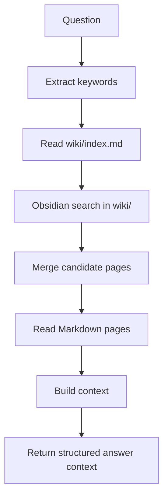
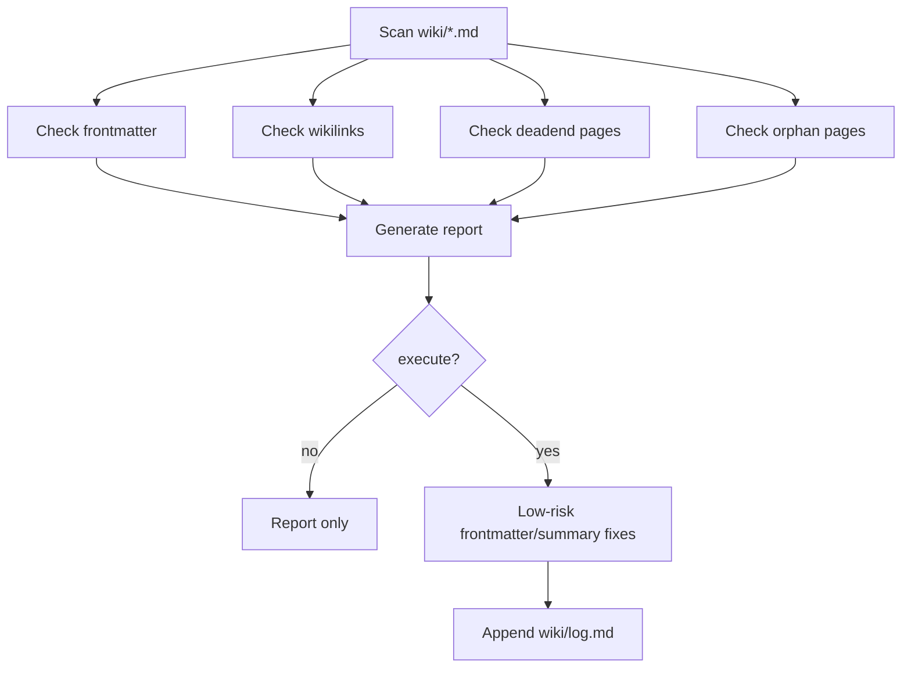
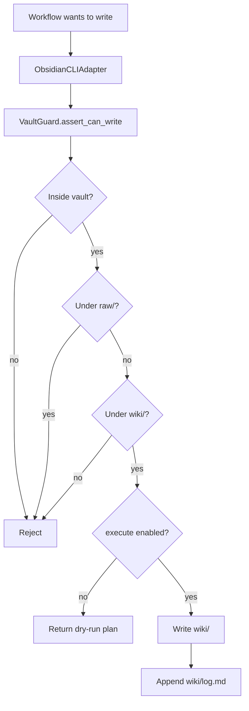

# Architecture

## 系统架构图

## 模块说明

- `nanobot_obsidian_wiki.config`
  - 定义 `WikiAgentConfig`，解析并校验 vault、schema、raw、wiki、log 路径。
- `nanobot_obsidian_wiki.schema_loader`
  - 启动工作流前读取 `TheSchema.md`，返回 `WikiSchema`。
- `nanobot_obsidian_wiki.intent_router`
  - 将自然语言请求路由为 `ingest`、`query`、`lint` 或 `unknown`。
- `nanobot_obsidian_wiki.obsidian_cli`
  - 封装 Obsidian CLI，CLI 不可用时 fallback 到 Python 文件读写。
- `nanobot_obsidian_wiki.vault_guard`
  - 负责路径安全和权限边界，防止 vault 外访问、路径穿越和 `raw/` 写入。
- `nanobot_obsidian_wiki.workflows`
  - 实现 Ingest、Query、Lint 工作流。
- `nanobot_obsidian_wiki.mcp_server`
  - 提供 MCP stdio server，暴露 `obsidian_wiki` tool，调用公开 Python API。

## 数据流

## Ingest 流程

## Query 流程

## Lint 流程

## 安全写入流程

